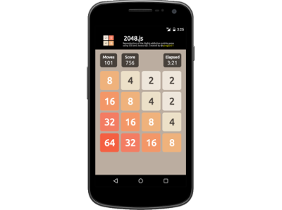

## 2048.js [](https://travis-ci.org/yongjun21/Project2048)

This game was my first project for General Assembly's Web Development Immersive. It is a reproduction of the highly addictive mobile game [2048](https://en.wikipedia.org/wiki/2048_\(video_game\)) made entirely with CSS and Javascript.

It runs on any desktop or mobile browser and supports both keyboard (arrow keys) and touchscreen (swipe) inputs.

Though fairly simple in design, I incorporated many elements to showcase my mastery of front end HTML/CSS/JS frameworks & Document Object Model (DOM).

1. To animate sliding of the tiles, I applied **CSS transition**
2. I also made used of **CSS keyframes** &  **trasform** to create the animation effect of spawning new tiles
3. Events listens like **keypress** & **ontouch** allow user to interact with the app and trigger sliding of the tiles
4. Whenever a user swipe in one direction, more than one tiles may start moving simultaneously and a few state changes may be required (such as two tiles merging into a new tile with a different set of styles applied). All these concurrent events are managed by clever use of **transitionend** listeners and a **async** callbacks handler
5. If you look carefully, you can see the tiles sliding behind the grid dividers rather than in front. This *window effect* is achieved by making use of a **SVG mask**
6. Inclusion of a **viewport meta** tag ensures app display properly across different platforms
7. JaveScript's native touch interface does not interpret movements on the touchscreen so I coded my own **swipe detector**
8. I also touched up my app with little details like a **favicon**

**Extra:** I have refactored my code to take advantage of hardware accelerated CSS by changing out all the left/top positioning to **translate(x, y)**. Expect to see fewer jank now when playing on a mobile browser.

This game is designed to be playable on both desktop and mobile devices. Fire up your mobile browser, enter [https://2048.daburu.xyx](https://2048.daburu.xyz) and swipe away to 2048!

Alternatively, I've included in this repo a version of this web app packed into an Android apk using Ionic. You can download the apk and install on your device and play it like a native Android app. Cool right?

Enjoy playing =)

#### Contributing to this project

If you like my app and will like to contribute, you can fork this repo and follow the instructions below.

On your terminal:
- Clone the forked repo into your local drive
```
git clone <url of forked repo>
cd Project2048
```
- Install dependencies
```
npm install
```
- Build
```
npm run start
```

After this, drop me a pull request

#### Some unfinished work:
1. I've haven't added in the Game Over logic and animation
2. Highscore/leaderboard?
